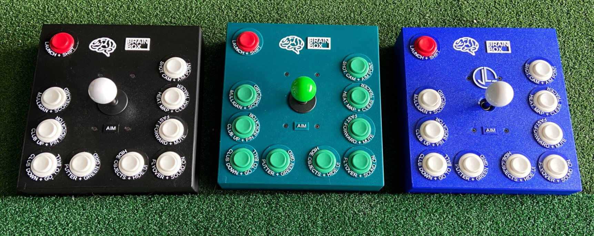
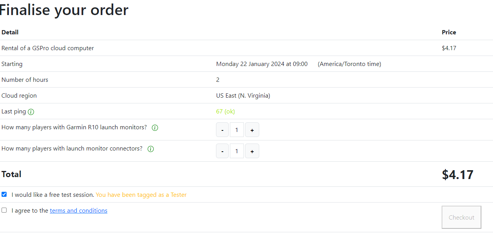
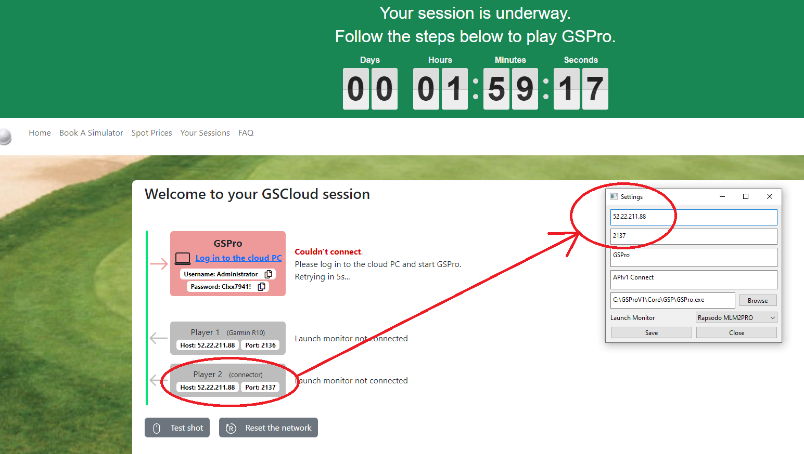
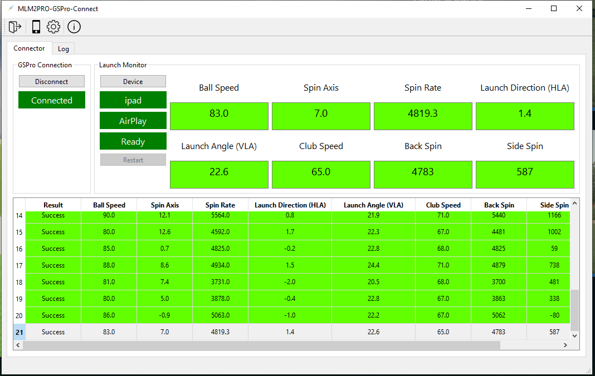
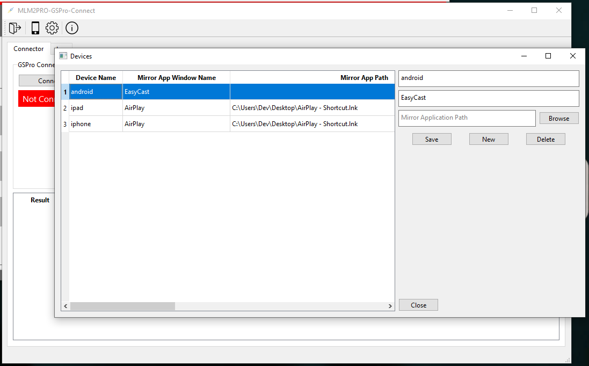
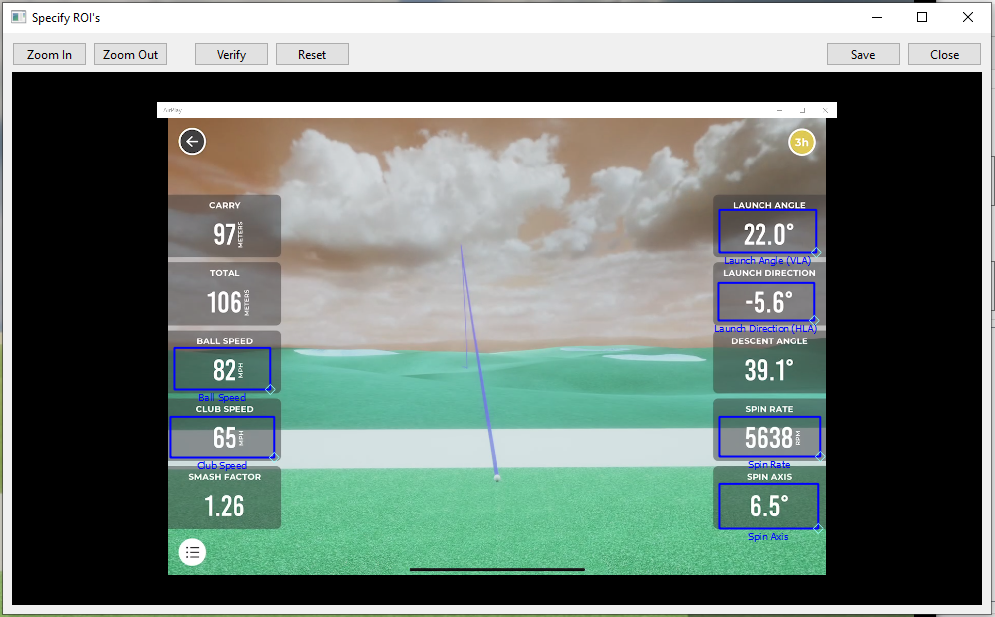
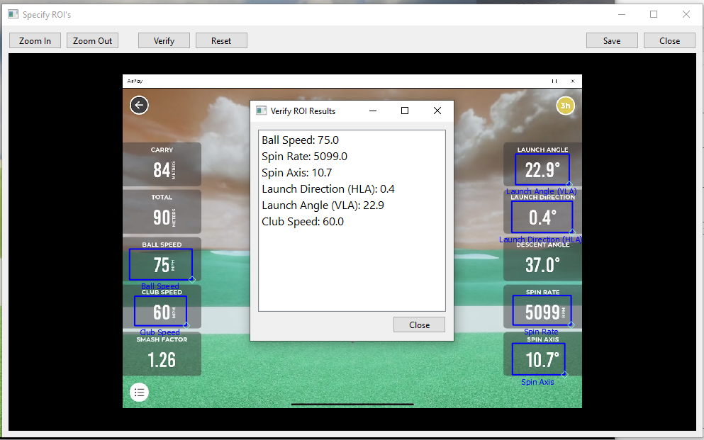
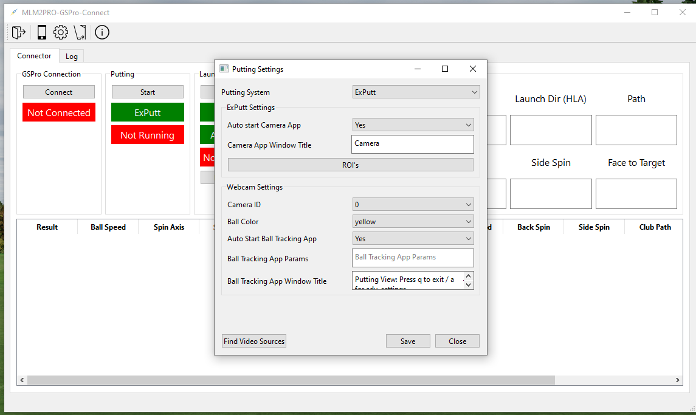

# MLM2PRO-GSPro-Connector
GSPro connector for the MLM2Pro & Mevo+ Launch Monitors that includes Webcam or ExPutt putting.

## Support me:
Any support greatly appreciated and will help me to continue to develop this connector.

If you are looking at a GSPro control box for your simulator, please consider my Brain Box it has some very unique features.

To find out more details you go to the online shop [here](https://cascadia3dpd.com/product/brain-box-golf-simulator-control-box-for-gspro/)

## Announcements:

### 7 February 24:

**GSCloud Support**

From V1.01.32 the connector now supports GSCloud. This means you can now use the connector with the GSCloud app.

*Thanks to Paul McMahon for his work on this.*

Go to https://golfsimcloud.com/, reserve a timeslot. 

And when that time comes, copy the IP settings from the second (player 2 / connector) area into the connector, replacing localhost/921 as shown.

### 3 November 23: 

**MEVO+ is now supported.**

We are excited to announce support for the Mevo+ launch monitor has now been added to the connector.

For more details see [here](https://github.com/springbok/MLM2PRO-GSPro-Connector/wiki/Mevo-)

## Highlights:

This connector was built from the ground up to be easy to use, reliable, accurate, and fast.

1. User Friendly
   - Windows application using a Graphical User Interface.
   - All configuration is done via user friendly dialogs.
   - Allows you to easily manage & select from multiple devices.
   
2. Performance:
   - True Windows multithreading with all processes running in seperate threads.
   - Direct use of Windows API which improves performance and reduces reliance on third party libraries.
   - Efficient detection of new shots.
   - Near instant response times.

3. Maintainability:
   - Uses Object-oriented programming techniques.
   - Code seperated into easily maintainable classes.

### Main Window

### Devices

### ROI's

### Verify ROI's

### Putting

## Documentation

* For a installation & setup video you can go [here](https://youtu.be/9mhtPu8xs0s)

* For a video on how to setup the Exputt with the connector you can go [here](https://www.youtube.com/watch?v=dV0CH2Vy0Y0)

* For a video on how to setup Webcam putting with the connector you can go [here](https://www.youtube.com/watch?v=6YxTzUPReB0)

* More detailed documentation can be found [here](https://github.com/springbok/MLM2PRO-GSPro-Connector/wiki)

### Joe Lagowski Connector Videos

Subscribe to Joe's YT channel [here](https://www.youtube.com/@JLagGOLF) 

* [How to connect your MLM2PRO and Ex Putt to play GS Pro!](https://www.youtube.com/watch?v=9wt06I_euHs&t=664s)

* [How to connect your Rapsodo MLM2PRO to GS Pro UPDATED!](https://www.youtube.com/watch?v=4iaM1k672ZU&t=1s)

* [THIS CHANGES EVERYTHING! Rapsodo MLM2PRO and EX Putt Playing GS Pro](https://www.youtube.com/watch?v=STaRJjlfda8&t=114s)

### Ben Rinken Videos

Ben has some great content on his YT channel, you can find it [here](https://www.youtube.com/@trpl_bgy) 

* [MLM2PRO GSPRO CONNECTOR - How to set up and configure](https://www.youtube.com/watch?v=-W3tzu48Ad0&t=366s)
* [No More MIS-READS! PERFECT ROI Settings for the MLM2Pro to GSPro Connector!](https://www.youtube.com/watch?v=gPnbO8ycCRY&t=219s)
* [#1 FATAL MISTAKE when Setting ROI's for MLM2Pro to GSPro Connector! HD-ROI's - How did I miss this!](https://www.youtube.com/watch?v=suuIaPTU70I&t=331s)

## Acknowledgments

### Joe Lagowski Facebook Group
I want to give a special thank you to members of Joe's FB group who did a lot of testing and provided invaluable feedback:

**Jarad Cohen**, thanks for your patience and hours of testing!\
**Joe Lagowski\
Ben Barratt**

If you want to join a great golfing community & watch some great golf content I'd encourage you to join Joe's FB group and subscribe to his YouTube channel:

To join the Facebook group follow this [link](https://www.facebook.com/groups/771573784649240)\
You can access Joe's YouTube channel [here](https://www.youtube.com/@JLagGOLF)

### Original Connector
[rowenb](https://github.com/rowengb) for producing the first [connector](https://github.com/rowengb/GSPro-MLM2PRO-OCR-Connector).

### Other Contributors

**[Paul McMahon (wonder99)](https://github.com/wonder99)** for his great work in adding putting to the original connector, also for his testing & valuable feedback.  

**[alleexx](https://github.com/alleexx)** for providing the webcam based putting utility, for more details go [here](https://github.com/alleexx/cam-putting-py). 

## Latest Release

The latest release can be downloaded from [here](https://github.com/springbok/MLM2PRO-GSPro-Connector/releases)

